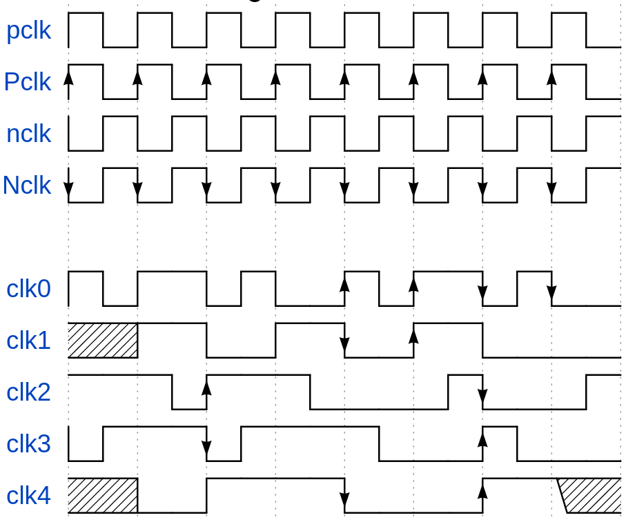

# gitbook-plugin-wavedrom

[](https://www.npmjs.org/package/gitbook-plugin-wavedrom)
[](https://travis-ci.org/vowstar/gitbook-plugin-wavedrom)
[](https://www.npmjs.org/package/gitbook-plugin-wavedrom)

[WaveDrom](http://wavedrom.com/tutorial.html) Plugin for [GitBook](https://github.com/GitbookIO/gitbook)

WaveDrom is a JavaScript application. WaveJSON is a format that describes Digital Timing Diagrams. WaveDrom renders the diagrams directly inside the browser. Element "signal" is an array of WaveLanes. Each WaveLane has two mandatory fields: "name" and "wave".

## Installation

    $ npm install gitbook-plugin-wavedrom

book.json add the plugin

```
{
  "plugins": ["wavedrom"]
}
```

## Features

* Support HTML, PDF, EPUB output(make sure your gitbook support SVG)
* Support ```wavedrom code block quote
* Multi code style support

### Beautiful Waveform



## Configuration

book.json add the wavedrom options

```
"pluginsConfig": {
  "wavedrom": {

  }
}
```

## Usage


To include a wavedrom waveform, just wrap your definition in a "wavedrom" code block. For example:

<pre lang="no-highlight"><code>```wavedrom
{ signal: [
  { name: "pclk", wave: 'p.......' },
  { name: "Pclk", wave: 'P.......' },
  { name: "nclk", wave: 'n.......' },
  { name: "Nclk", wave: 'N.......' },
  {},
  { name: 'clk0', wave: 'phnlPHNL' },
  { name: 'clk1', wave: 'xhlhLHl.' },
  { name: 'clk2', wave: 'hpHplnLn' },
  { name: 'clk3', wave: 'nhNhplPl' },
  { name: 'clk4', wave: 'xlh.L.Hx' },
]}
```
</code></pre>

Also you can put in your book block as

```

{ signal: [
  { name: "pclk", wave: 'p.......' },
  { name: "Pclk", wave: 'P.......' },
  { name: "nclk", wave: 'n.......' },
  { name: "Nclk", wave: 'N.......' },
  {},
  { name: 'clk0', wave: 'phnlPHNL' },
  { name: 'clk1', wave: 'xhlhLHl.' },
  { name: 'clk2', wave: 'hpHplnLn' },
  { name: 'clk3', wave: 'nhNhplPl' },
  { name: 'clk4', wave: 'xlh.L.Hx' },
]}

```

Template mode:

```

```

> If use both configure method, the code configure will overwrite the template configure.

### Learn WaveDrom and more information

[WaveDrom](http://wavedrom.com/tutorial.html)

### Thanks

- [@ly0](https://github.com/ly0)
- [@0x00-pl](https://github.com/0x00-pl)
- [@manageryzy](https://github.com/manageryzy)
